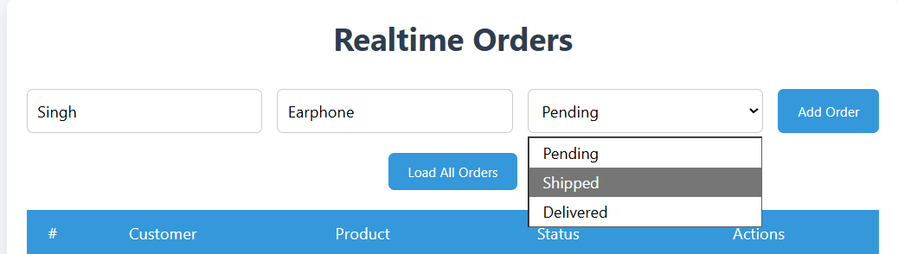
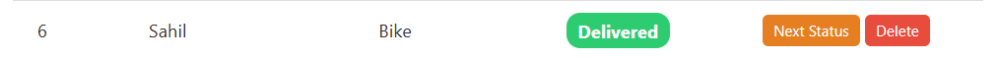
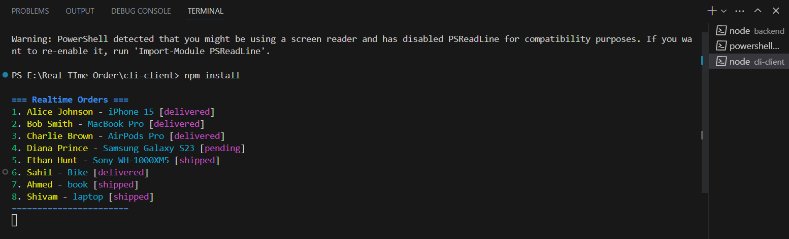
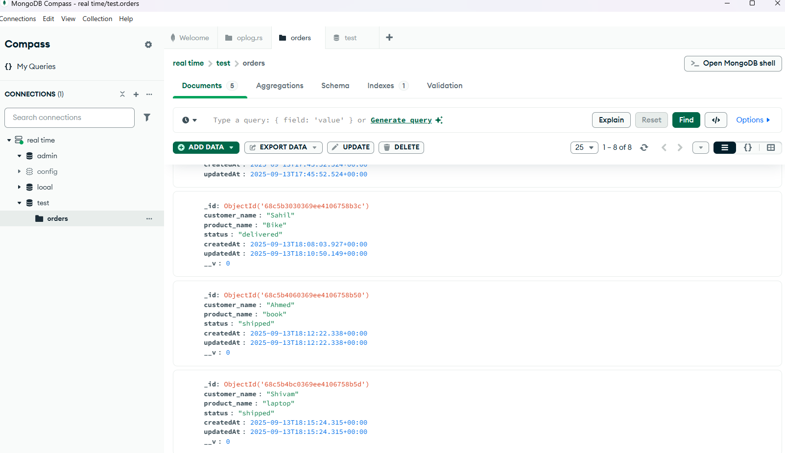
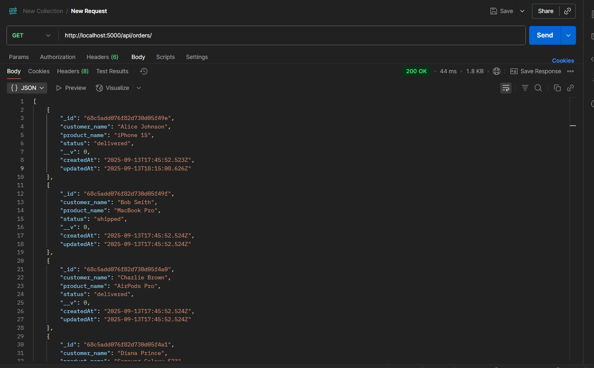
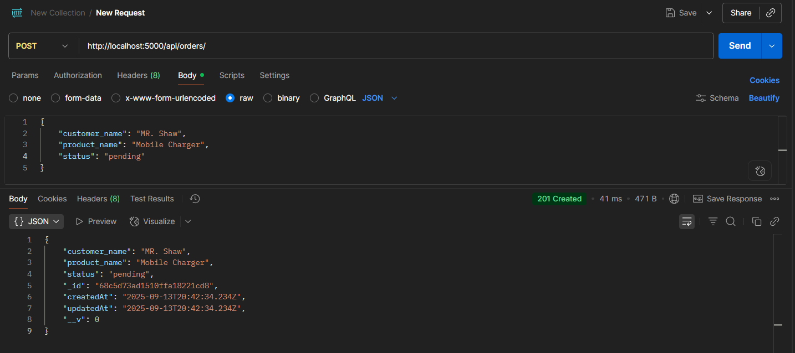
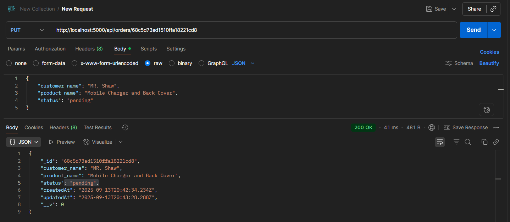
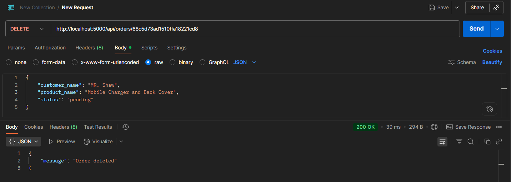

# 📦 Real-Time-Order-Tracking-Backend

A system where clients automatically receive updates whenever data in the database changes

## 👩‍🏫 Overview
This project implements a **realtime order management system** using **Node.js**, **MongoDB**, and **Socket.IO**.  
Clients (browser or CLI) are notified instantly when orders are created, updated, or deleted.

---

## 🔧 Features
- ➕ Add, update, and delete orders.
- 🔔 Real-time updates to all connected clients.
- 🌐 Browser frontend with responsive table and colored status badges.
- 🖥️ CLI client for terminal-based live updates.
- ⚡ MongoDB Change Streams for efficient real-time database listening.

---

## 🛠️ Tech Stack
- **Backend:** Node.js + Express.js
- **Database:** MongoDB
- **Realtime:** Socket.IO
- **Frontend:** HTML, CSS, JavaScript
- **CLI Client:** Node.js

---

## 📂 File Structure
```plaintext
realtime-orders-project/
├── 📁backend/
│   ├── server.js
│   ├── package.json
│   ├── .env
│   ├── routes/
│   │   └── orders.js
│   ├── controllers/
│   │   └── ordersController.js
│   └── models/
│       └── Order.js
├── 🌐frontend/
│   ├── index.html
│   ├── app.js
│   └── styles.css
├── 💻cli-client/
│   ├── package.json
│   └── index.js
└── README.md
```

---

## ⚙️ Project Setup

### 1️⃣ Clone the repository
```bash
git clone https://github.com/Sahil0p/Real-Time-Order-Tracking-Backend
cd Real-Time-Order-Tracking-Backend
```

### 2️⃣ Backend Setup
```bash
cd backend
npm install
```
- Create a .env file:
```bash
PORT=5000
MONGO_URI=<your_mongodb_connection_string>
```
- Start backend server:
```bash
npm run dev
```

### 3️⃣ Frontend Setup
```bash
cd frontend
# Open index.html in your browser or use a live server extension
```

### 4️⃣ CLI Client setup (optional)
```bash
cd cli-client
npm install
node index.js
```

---

## 📸 Frontend Screenshots

### 1️⃣ Home Page (Includes a table to add new orders and then you can see the total numbers of orders below after clicking "Load All Orders")
- 

### 2️⃣ Adding new Orders with Status
- 

### 3️⃣ Updating the Status & Deleting the Order (With 2 Button NEXT/DELETE we can perform this operation)
- 

---

## 💻 CLI Client Screenshot
### The CLI client will automatically display new orders, updates, or deletions in real time in your terminal
- 

---

## 🗂️ Backend Screenshots

### 1️⃣ MongoDB Database (Order tables)
- 

### 2️⃣ Fetching all orders in POSTMAN API Testing
- 

### 3️⃣ Adding New Order Information
- 

### 4️⃣ Updating the existing order information by using - Order ID
- 

### 5️⃣ Deleting order information by using - Order ID
- 
---

## 🏗️ Architecture
### ⚙️ Backend
- Express.js routes handle CRUD operations.
- MongoDB Change Streams watch the orders collection.
- Socket.IO pushes changes to all connected clients in real time.

### 🌐 Frontend
- Fetches all orders on load.
- Listens for real-time updates via Socket.IO.
- Displays orders in a responsive table with colored status badges.

### 💻 CLI Client (optional)
- Connects to the same Socket.IO server.
- Displays orders in the terminal.
- Updates automatically when orders change.

---

## 📡 API Endpoints
```bash
......................................................
| Method | Endpoint        | Description             |
|--------|-----------------|-------------------------|
| GET    | /api/orders     | Fetch all orders        |
| POST   | /api/orders     | Create new order        |
| PUT    | /api/orders/:id | Update order by ID      |
| DELETE | /api/orders/:id | Delete order by ID      |
|........|.................|.........................|
```
---

## 🧑‍💻 Usage
- 🌐 Open the browser frontend to view all orders in realtime.
- ➕ Add new orders via the form.
- ✏️ Update or delete orders using table buttons.
- 🧪 Or open Postman to do CRUD Operation (adding, updating and deleting the orders)
- 💻 Watch the CLI client to see live updates in terminal.
- 📊 Inspect MongoDB database for stored data.

---

## 🤔 Why this approach
- ⚡ Node.js + Socket.IO enables efficient real-time updates.
- 🍃 MongoDB Change Streams allow event-driven notifications without polling.
- 🖥️ Simple HTML/CSS/JS frontend demonstrates functionality clearly.
- 💻 CLI client provides a terminal view for testing real-time updates.


---

##🚀 Future Improvements

- 🔐 Add authentication for secure access.
- 🐳 Dockerize the application for easier setup.
- 🔍 Implement filtering & search in frontend.
- 🧪 Add unit tests for backend.
